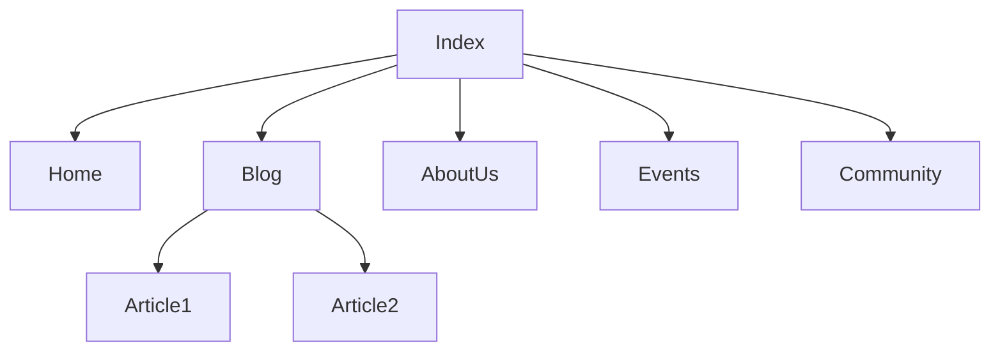
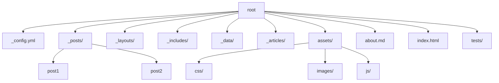
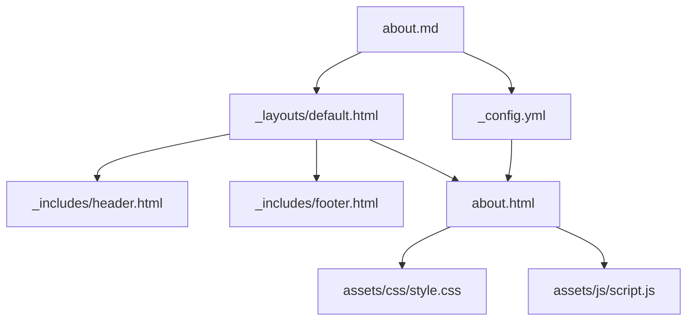

# Contributing to Black Python Devs Projects

Follow these steps and note these guidelines to begin contributing:

1. First step is to set up the local development environment.
1. Bug fixes are always welcome. Start by reviewing the [list of bugs](https://github.com/BlackPythonDevs/blackpythondevs.github.io/issues).
1. A good way to easily start contributing is to pick and work on a [good first issue](https://github.com/BlackPythonDevs/blackpythondevs.github.io/labels/good%20first%20issue). We try to make these issues as clear as possible and provide basic info on how the code should be changed, and if something is unclear feel free to ask for more information on the issue.

# Diagram of the infrastructure in use

Below are some diagrams to best explain the file structure of the website, the development structure and how some information are been generated

## Website structure

The diagram below illustrates the main navigation structure of BPD website, showing how the homepage `(Index)` connects to various sections, including the `Home`, `Blog`, `About Us`, `Events`, and `Community`. Each blog article, represented as `Article1` and `Article2`, is linked directly from the `Blog` section.

## Development structure

The diagram below outlines the file structure of the development environment. The root node represents the main directory, containing essential files and folders like `_config.yml`, `_posts`, `_layouts`, `_includes`, `_data`, `_articles`, and `assets`. Each folder contains further organization of specific files. This will aid contributors in understanding how the project is organized and where different components are located.

## How some information are generated

The diagram below explains how information is generated for the about page, showing how the `about.md`(source content) connects with other contents, templates and configuration files. The `about.md` file links to `_layouts/default.html` and `_includes/header.html` and `footer.html`, which define the page layout and thus generates a `about.html` this html file can be styled and scripted with files in the `assets/` folder. This diagram clarifies the rendering process and how different files work together to create the final output for the about page.

# How to Contribute

## Fork the repository

- To fork the repository so you have a copy of the codebase, you will click on the **"Fork"** button from the repository main page

  

- Clicking on the Fork button takes you to the **"Create New Fork"** page where you select the owner (your personal github account) and click on the Create fork button.

  

## Creating an issue

- Click on the issues tab in the repository.

  

- Click on the green button with the label **"New issue"** and you should see the image below:

  

- Type in the issue title in the title textbox and type in a clear explanation of the issue in the textarea. You can add images, code snippets, etc to explain your issue.

- Once you are done, you can preview your issue by selecting the Preview tab. If you are satisfied with the issue presentation, you can click on the green "Submit new issue" button to create your issue.

- And that's it! If you choose to comment requesting the issue to be assigned to you, wait for a maintainer to do so. You should get an email notification of the issue being assigned to you or you can view the issue assignment in the issue page. It should look similar to this:

  

## Working on an issue

- Please create a separate branch for each issue you work on. Avoid working on multiple issues from the same branch, as this can complicate the review process
- The easiest way to make changes and and test them is by using 

- You can also access the Codespaces from the repository main page:

  

- The web version of VSCode should open in a new tab in your browser:

  

- Now that you have the code editor set up, you need to install the dependencies. To do this, you have to open the code editor's terminal and run the command `bundle install`.

- The easiest way to open the terminal is to click on the 3 horizontal lines (also known as hamburger) at the top left of the code editor > Terminal > New Terminal:

  

- In the terminal run the command `bundle install`.

  

- Afterwards, run the command `pip install -r requirements-dev.txt` to install the python dev dependencies.

  

- Install the pre-commit hooks to automatically format the code before committing. Run the command `pre-commit install`:

  

- After installing the dependencies, its time to run the application. We do this by running the command `bundle exec jekyll serve --detach` or run the default **Build Task** <kbd>Ctrl</kbd> + <kbd>Shift</kbd> + <kbd>B</kbd>:

  

- The server address shows `http://127.0.0.1:4000`. This is the address for any local computer so this server will be wrong since the application is running on a remote computer so we have to get the address of that computer. We can get the address by clicking on the Ports tab next to the Terminal:

  

- <kbd>Ctrl</kbd> + Click on the Forwarded Address assigned to Port 4000. This will open the running application in a new tab:

  

### Testing Changes (create new tests as needed)

- To run the test suites for the codebase

  - Ensure the site is running locally with `bundle exec jekyll serve --detach`. This will run the server in the background, and any content changes will immediately reflect on the site.

    

    - If you need to restart the server, you can run `pkill -f jekyll` to stop the server and then run `bundle exec jekyll serve --detach` to start the server again.

  - Run all tests in the test-suite with the command `python3 -m pytest`:

    

### Pushing Changes

- Run `pre-commit run --all` to ensure your code is formatted and linted correctly before pushing your changes.

  

- Run `git commit -m "<Your commit message>"` to commit your changes.

  

- Finally run `git push origin <your-branch-name>` to push your changes to your fork.

  

- Once you’ve committed and pushed all of your changes to GitHub, go to the page for your fork on GitHub, select your development branch, and click the pull request button. Please ensure that you compare your feature branch to the desired branch of the repo you are supposed to make a PR to. If you need to make any adjustments to your pull request, just push the updates to GitHub. Your pull request will automatically track the changes in your development branch and update it. 🥳
