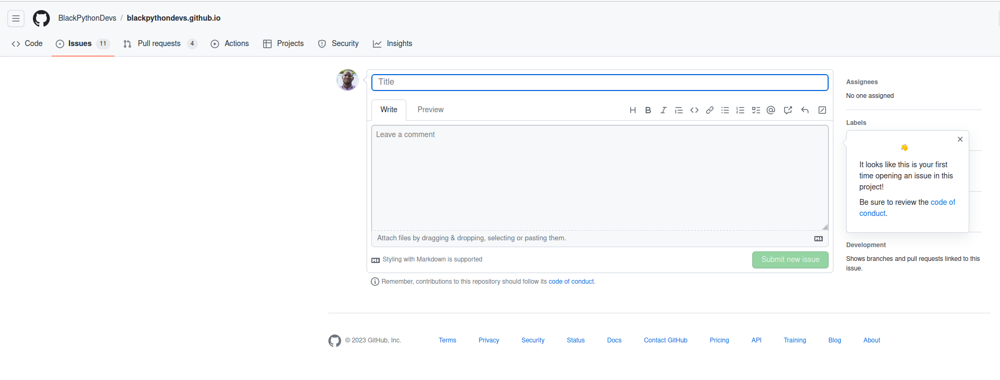
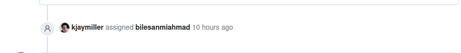
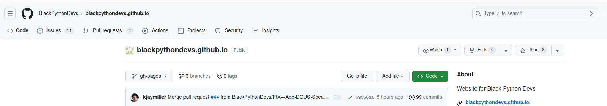
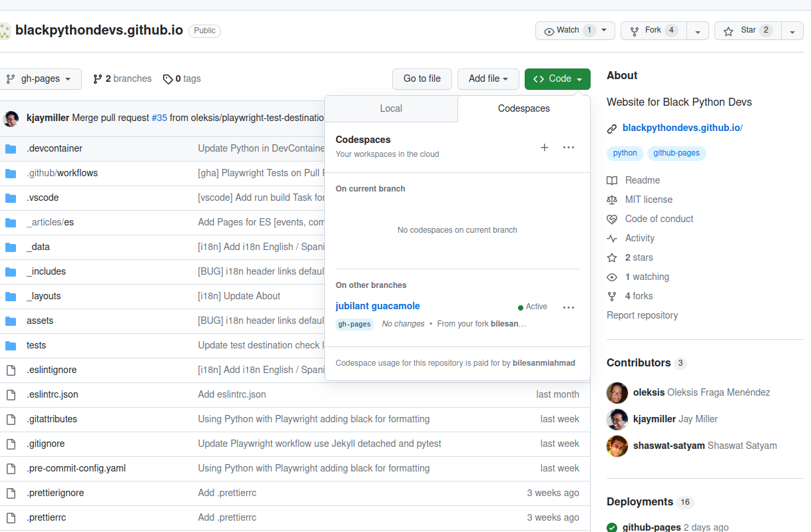
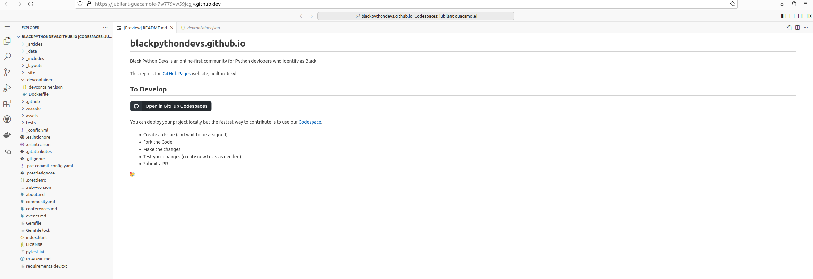
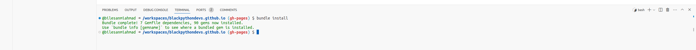
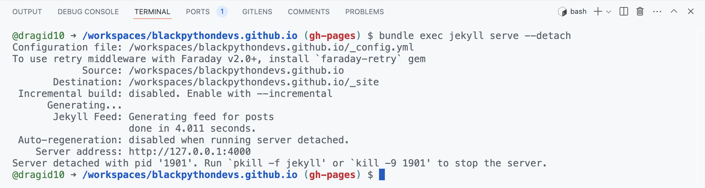
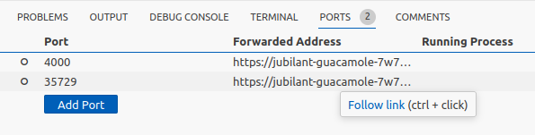

# blackpythondevs.github.io

Black Python Devs is an online-first community for Python devlopers who identify as Black.

This repo is the [GitHub Pages](https://pages.github.com/) website, built in Jekyll.

## To Develop

You can deploy your project locally but the fastest way to contribute is to use our [Codespace](<(https://github.com/features/codespaces/)https://github.com/features/codespaces/>).

### 1. Create an Issue (and wait to be assigned)

- Click on the Issues tab in the repository.

    

- Click on the green button with the label "New issue" and you should see the image below:

    

- Type in the issue title in the title textbox and type in a clear explanation of the issue in the textarea. You can add images, code snippets, etc to explain your issue.
- Once you are done, you can preview your issue by selecting the Preview tab. If you are satisfied with the issue presentation, you can click on the green "Submit new issue" button to create ypur issue.
- Now you wait for your issue to be assigned to you by an admin. You should get an email notification of the issue being assigned to you or you can view the issue assignment in the issue page. It should look similar to this:

    

### 2. Fork the Code

- To fork the repository so you have a copy of the codebase, you will click on the "Fork" button from the repository main page

    

- Clicking on the Fork button takes you to the "Create New Fork" page where you select the owner (your personal github account) and click on the Create fork button.

    

### 3. Make the changes

- The easiest way to make changes and and test them is by using 
- You can also access the Codespaces from the repository main page:
  

- The web version of VSCode should open in a new tab in your browser:
  

- Now that you have the code editor set up, you need to install the dependencies. To do this, you have to open the code editor's terminal and run the command `bundle install`.
- The easiest way to open the terminal is to click on the 3 horizontal lines (also known as hamburger) at the top left of the code editor > Terminal > New Terminal:

    

- In the terminal run the command `bundle install`.

    

- After installing the dependencies, its time to run the application. We do this by running the command `bundle exec jekyll serve`:

    

- The server address shows `http:127.0.0.0.1:4000`. This is the address for any local computer so this server will be wrong since the application is running on a remote computer so we have to get the address of that computer. We can get the address by clicking on the Ports tab next to the Terminal:

    

- Ctrl + Click on the Forwarded Address assigned to Port 4000. This will open the running application in a new tab:

    

- Test your changes (create new tests as needed)
- Submit a PR

🥳
